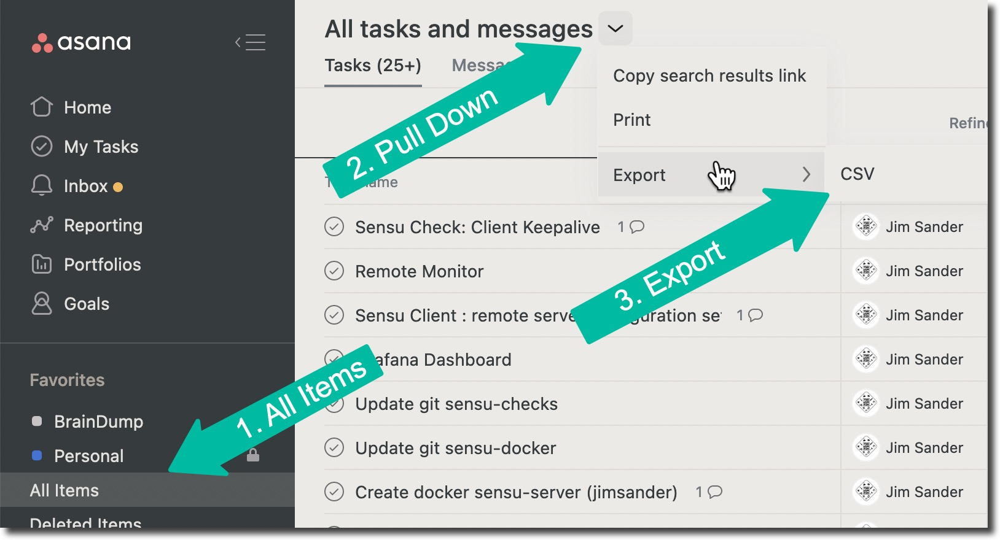

# Asana To Task Warrior

## Simple steps to dump Asana For Task Warrior
Won't go into the details of [Task Warrior](https://taskwarrior.org/), if you're here then likely already aware.

'foo'

## Converting Asana to TaskWarrior tasks

| 1. Export Asana tasks as CSV | <a href="img/asana_export.jpg" target="_blank" border="0"></a> |
|------------------------------|---------------------------------------------------------------------------------------------------------------------------|
| -  Browser Only              |                                                                                                                           |
|                              | 1. Select All Items                                                                                                       |
|                              | 2. Grab the PullDown                                                                                                      |
|                              | 3. Export to CSV                                                                                                          |
   2.  Sidenote Gotcha:
       - Something I ran into was the [**BOM** *(\ufeff)](https://en.wikipedia.org/wiki/Byte_order_mark) string was in the beginning of the csv
       - Must have been inserted when saving from LibreOffice, who knows
       - Remove that by using vi ```:set nobomb``` and save file
1. convert to json (see cjParse.py)
1. Run through [jq](https://stedolan.github.io/jq/manual/)
1. Run through sed and awk and capture output into a *script*
1. Edit the capture *script* accordingly
1. Happy with it?  Run it.

## Long One-Liner
Didn't bother with finessing the **jq** filter, just ran it through 
a littany of seds
```
cat samples/AsanaDump.csv | ./cjParse.py |\
jq  '.[]| @sh "\(.Name)___\(.Projects)"' | \
sed "s/^\"'//" | sed "s/'\"$//" | sed "s/'___'/___/" | sed "s/ ___/___/" |\
awk -F'___' '
  { pro=""; split($2,p,","); 
  for (i in p){ pro=sprintf("pro:%s %s",p[i],pro)  };
  printf("task add %s %s\n", $1, pro ) }' | \
head -3 | tee mynewtasks.sh
```

## Output Sample
There's your sample script 
- Notice the projects were added 
- Cleanup up your output script as needed

```
task add Sensu Check: Client Keepalive pro:BrainDump pro:DCM-Sensu
task add Sensu Client : remote server configuration setup pro:BrainDump pro:DCM-Sensu
task add Add Install for ec2-ami-tools in imageServer pro:BrainDump
```
